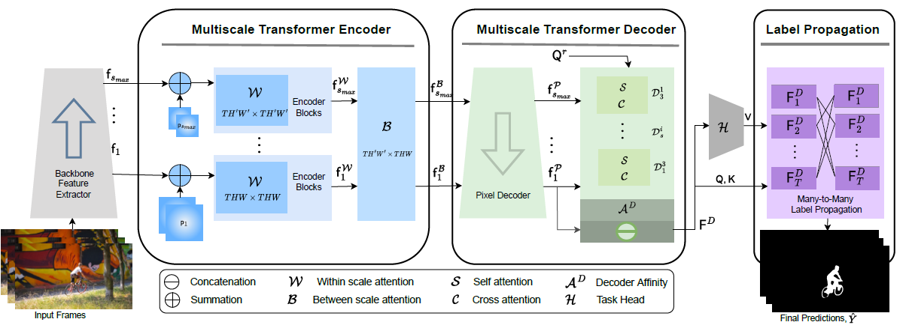

## Abstract 
<p style="text-align: justify">
Multiscale video transformers have been explored in a wide variety of vision tasks. To date, however, the multiscale processing has been confined to the encoder or decoder alone. We present a unified multiscale encoder-decoder transformer that is focused on dense prediction tasks in videos. Multiscale representation at both encoder and decoder yields key benefits of implicit extraction of spatiotemporal features (i.e. without reliance on input optical flow) as well as temporal consistency at encoding and coarse-to-fine detection for high-level (e.g. object) semantics to guide precise localization at decoding. Moreover, we propose a transductive learning scheme through many-to-many label propagation to provide temporally consistent predictions. We showcase our Multiscale Encoder-Decoder Video Transformer (MED-VT) on Automatic Video Object Segmentation (AVOS) and actor/action segmentation, where we outperform state-of-the-art approaches on multiple benchmarks using only raw images, without using optical flow.
</p>


## Method Overview


<p style="text-align: justify">
Detailed (MED-VT) architecture with unified multiscale encoder-decoder transformer, illustrated with application to Automatic Video Object Segmentation (AVOS). The model has four functionally distinct components. (i) Backbone feature extractor to extract per frame features at multiple scales. (ii) Multiscale transformer encoder consisting of spatiotemporal within and between scale attention with resulting features; the multihead attention transformation is used for both. (iii) Multiscale transformer decoder consisting of pixel decoding, which produces decoded features and a series of mulitscale query learning decoder blocks, that iterate across scales, each of which entail self and cross attention. The input to the blocks are the decoded features and the query resulting from the previous block; the output is a final object query. The decoder applies an affinity between the learned query and the finest scale decoded features to yield an object attention map, which is concatenated with the finest scale decoded features for final decoder output (iv) A many-to-many label propagation and a shallow (three layer) 3D-CNN module that inputs decoder features to produce temporally consistent segmentation masks. A many-to-many label propagation module using masked attention. The mask can be defined to promote communication between data points in a wide variety of fashions (e.g within frame, between frames, many-to-one, many-to-many).  We use this mechanism for temporal many-to-many propagation to encourage information sharing among different frames. Additionally, we explore theoretical connections between our label propagation approach and spectral clustering.</p>


## Qualitative Results


<p style="text-align: justify">Here are some qualitative segmentation results (red masks) of our approach compared to the ground-truth segmentation mask and a single scale baseline. We provide two examples on DAVIS’16 and two examples on MoCA dataset. </p>

<div style="text-align: justify">
<ul>
    <li>Davis (Dance-Twirl): The dancer on this video exhibits complex, deforming motion and requires fine localization precision to delineate limbs. MED-VT deals with both challenges in a temporally consistent fashion, with consistency from the encoder as well as label propagator and localization from the decoder. In comparison, the baseline inconsistently captures the limbs, if at all.</li>

<li>Davis (Breakdance): In addition to the complex, deforming motion of the dancer, this video also has moving person as background exhibiting motion and similarity in appearance to foreground. MED-VT deals with these challenges and able to separate the dancer with primary dominant motion from the background. In addition the segmentation mask is temporally consistent across the frames.</li>

<li>MoCA (Flounder): The fish on this video is almost impossible to detect in a single frame due to its strong camouflage. MED-VT defeats the camouflage to precisely and consistently delineate the body as the encoder consistently abstracts critical motion, while the baseline largely fails.</li>

<li>MoCA (Hedgehog): The hedgehog in this video exhibit strong camouflage in a low light scenario with several background objects of similar color. MED-VT can segment the hedgehog in this extreme camouflaged hedgehog while the baseline segmentation results in many false positives.</li>
    </ul>
</div>


<table style="border-collapse: collapse; border: none;">
    <tr style="border: none;"> 
        <td style="border: none;text-align: center"> 
            <video width="380" height="300" controls>
                <source src="./data/davis-dance-twirl.mp4" type="video/mp4">
                Your browser does not support the video tag.
            </video> <br> Davis (Dance-Twirl) 
        </td>
        <td style="border: none;text-align: center"> 
            <video width="380" height="300" controls>
                <source src="./data/breakdance_10.mp4" type="video/mp4">
                Your browser does not support the video tag.
            </video>  <br> Davis (Breakdance)
        </td>
    </tr>
    <tr style="border: none;"> 
        <td style="border: none;text-align: center"> 
            <video width="380" height="300" controls>
                <source src="./data/moca-flounder_6.mp4" type="video/mp4">
                Your browser does not support the video tag.
            </video> <br> MoCA (Flounder)  
        </td>
        <td style="border: none;text-align: center"> 
            <video width="380" height="300" controls>
                <source src="./data/hedgehog_1_10.mp4" type="video/mp4">
                Your browser does not support the video tag.
            </video>  <br> MoCA (Hedgehog) 
        </td>
    </tr>
</table>


## Quantitative Results


<p style="text-align: justify"> Here we present results for both AVOS and Actor-Action segmentation using ResNet and SwinB as feature extractor backbone. For AVOS, we test on three standard datasets: DAVIS’16, YouTube-Objects, and MoCA (Moving Camouflaged Animals) . DAVIS’16 is a widely adopted AVOS benchmark, while YouTube-Objects is another large-scale VOS dataset. MoCA is the most challenging motion segmentation dataset available, as in the absence of motion the camouflaged animals are almost indistinguishable from the background by appearance alone (i.e. colour and texture). For actor/action segmentation, we use the A2D dataset. The results are presented here for region similarity (mean-iou). </p>

| Backbone  | Davis'16 | YouTube-Objects | MoCA | A2D |
|---------- |----------|-----------------|------|-----|
| ResNet101 | 83.5 | 75.2 | 69.4 | 39.5 |
| SwinB     | 85.9 | 78.5 | 77.9 | 52.6 |


## Cite


```tex
@inproceedings{medvt23,
  title={ {MED-VT}: Multiscale Encoder-Decoder Video Transformer with Application to Object Segmentation},
  author={Rezaul Karim and He Zhao and Richard P. Wildes and Mennatullah Siam},
  booktitle={Proceedings of the IEEE/CVF Conference on Computer Vision and Pattern Recognition },
  year={2023}
}
```


[Back To Home](../)
